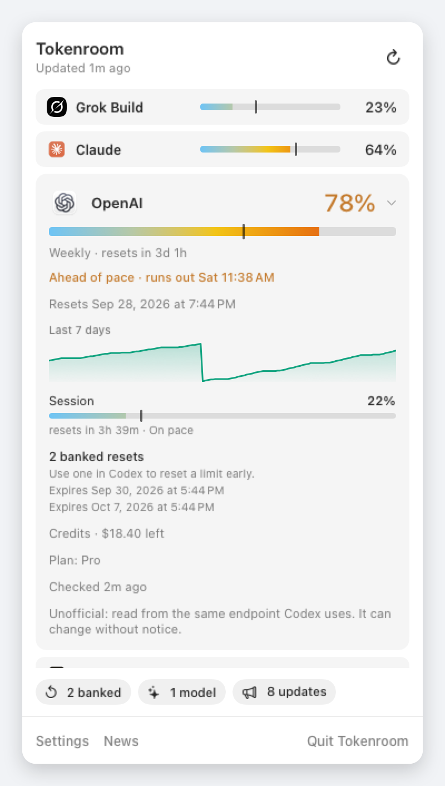
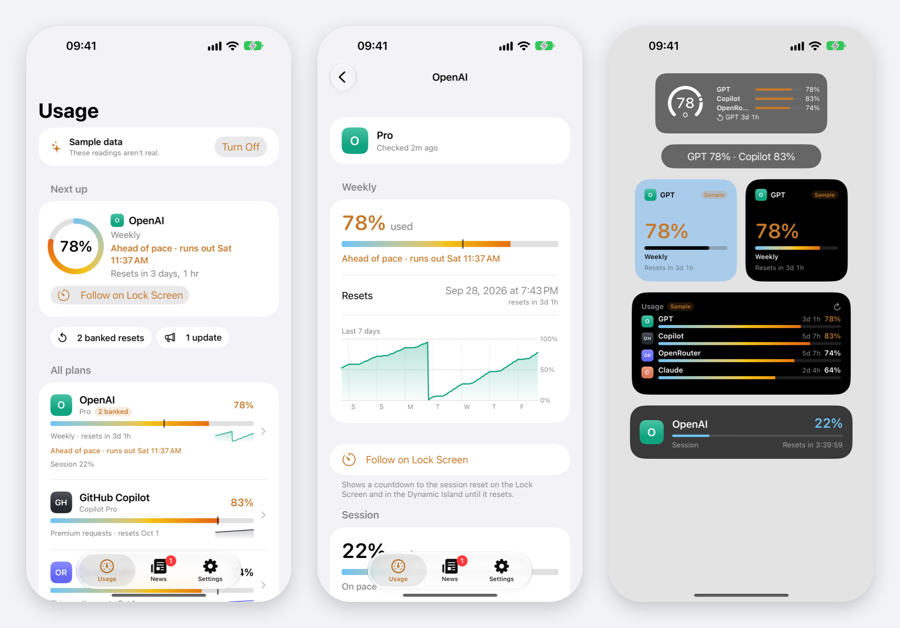

<p align="center">
  
</p>

<h1 align="center">Tokenroom</h1>

<p align="center">
  <strong>AI plan usage in the macOS menu bar, on your iPhone, and on your wrist.</strong><br>
  Claude, Codex, Grok, Cursor, Copilot, and 14 more: used percent, pace, and reset time on your Mac, iPhone, and Apple Watch.
</p>

<p align="center">
  
  
  
  
</p>

<p align="center">
  
</p>

Tokenroom is a menu-bar extra. It does not live in the Dock. It reuses logins you already have. For pay-as-you-go and organization billing you can add an API key, which stays in your Keychain. It does not keep names, emails, or tokens on disk.

Tokenroom was called Headroom until 2.0. On first launch it brings over Headroom’s settings and last readings; quit Headroom and move it to the Trash afterwards.

<p align="center">
  
</p>

## Glance first

The extra shows **used %** for every provider you turned on.

| Provider | What you see | Connect with |
| --- | --- | --- |
| Grok Build | Weekly pool | `grok login` |
| Grok Bot | Weekly pool | Grok Bot app |
| Claude | 7-day window | `claude login` |
| OpenAI (Codex) | Weekly window | `codex login` |
| Cursor | Billing cycle | Cursor app |
| GitHub Copilot | Monthly AI credits | `gh auth login`, a Copilot editor extension, or a fine-grained token |
| Antigravity | Gemini weekly | Antigravity, and `agy` 1.1.11 or later |
| Devin | Weekly quota | Devin app |
| Z.ai, MiniMax | Weekly or 5-hour | The key in Claude Code’s settings, or add one |
| Kimi Code | Weekly | `kimi` login, or add a key |
| OpenCode Go | Weekly | OpenCode’s login, or add a key |
| OpenRouter | Key limit, or spend | API key |
| DeepSeek, Moonshot, Vercel AI Gateway | Balance | API key |
| OpenAI, Anthropic, and xAI organizations | This month’s spend | Admin key |

Click the extra for the popover. Each provider shows its meter with a tick where an even pace would be, so you can see at a glance whether you're running ahead. With more than five providers connected, each gets one line.

<p align="center">
  
  
</p>

Click a provider for its details:

- **Every window**: weekly, session, per-model limits, and extra usage, each with its reset time.
- **Pace**: "Ahead of pace · runs out Sat 11:37" when you'd hit the limit before it resets.
- **A week of history**, with the resets marked.
- **Forecasts**: how many days a balance lasts at this week's rate, and where this month's spend is heading.
- **Banked resets** (Codex) and when each expires.

The footer strip counts banked resets, new models, and updates; click one to open it. Cursor is labeled **This cycle**, never Weekly.

## News

New models from the labs you follow (from OpenRouter's public model list) and official changelogs and blogs from the tools you use: Claude Code, Codex and ChatGPT, Gemini and Antigravity, GitHub Copilot, Cursor, Devin, Z.ai, Kimi Code, MiniMax, and OpenRouter. It's off on the Mac until you turn it on in **Settings → News** or from the News window. Only the public feeds are read; nothing about you is sent.

## Alerts

At 80% and 95%, when a busy window resets, when a banked reset arrives or is about to expire, and when a balance or budget runs low. Each alert goes out once, from whichever device sees it first. Quiet hours hold the ones that can wait until morning. Set them in **Settings → Alerts** on the Mac or in the iPhone app; the choices are shared through iCloud.

## Why it exists

Each of those tools already knows how much quota you have left. None of them put it next to the clock. Tokenroom does, as tiny percents or iStat-style meters, then gets out of the way.

- **Local-first.** No Tokenroom account, no Tokenroom server, no telemetry.
- **Your logins.** Sessions stay where each tool keeps them. Tokenroom only reads them.
- **Independent meters.** One provider failing never blanks the others.
- **Three looks.** Percents, vertical used-bars, or only the highest, for the providers you pick. Refresh every 5, 10, 15, or 30 minutes. Launch at login if you want.

Numbers in the screenshots are sample data.

## iPhone and Apple Watch

<p align="center">
  
</p>

Tokenroom for iPhone shows the same meters, pace, and a week of history. They come from your Mac through your own iCloud. The iPhone also reads coding plans (including GitHub Copilot with a fine-grained token), pay-as-you-go balances, and organization spend itself, with keys you add there. It adds:

- **Next up**: the most pressing limit, with its pace, a live countdown to the reset, and Follow on Lock Screen
- Home Screen and Lock Screen widgets, with countdowns that tick without draining the widget budget
- a Live Activity that follows a session, or a nearly spent week, to its reset; start it from the app, Control Center, the Action button, or Siri ("Follow usage in Tokenroom")
- the alerts above, as notifications, even when the app isn't running
- News, with a badge for what's new

The Apple Watch app and its complications read the same iCloud records, so they keep working with the iPhone away. The Smart Stack shows a limit as it nears its reset or passes 80%. To send your Mac's readings, turn on **Settings → iPhone & Watch** in the signed download of Tokenroom for Mac. A copy you build and sign yourself can't use iCloud.

Tokenroom for iPhone and Apple Watch is on its way to the App Store. It has a sample mode for looking around first.

## Install

Download `Tokenroom-2.0.0.zip` from the [latest release](https://github.com/felipedrf74/tokenroom/releases/latest), unzip it, and move Tokenroom.app to Applications. It's signed with a Developer ID and notarized by Apple, so it opens without warnings, and it's the build that can sync with the iPhone and Apple Watch apps.

Or build it on the Mac that will run it (a build signed on your Mac works, but can't sync with iPhone):

```bash
git clone https://github.com/felipedrf74/tokenroom.git
cd tokenroom
./scripts/build.sh
open /Applications/Tokenroom.app
```

Xcode 27 is preferred. Command Line Tools are enough for the `swiftc` fallback.

After opening, look at the **right side of the menu bar**. Opening the app again from Finder re-shows the popover.

The build is ad-hoc signed and **not sandboxed** — it has to read CLI credential files. If macOS blocks the first launch: **System Settings → Privacy & Security → Open Anyway**.

## Sign in

1. Click Tokenroom in the menu bar.
2. On a provider that isn’t connected, click **Sign In**, or **Add Key** for key-based providers.
3. Finish login in the browser, Terminal, or app that opens.
4. Tokenroom picks up the session and shows usage.

The same controls live in **Settings → Providers**. Turning a provider off hides it from Tokenroom; it does not log you out of that provider.

Tokenroom only reads sessions. It never refreshes or rewrites another tool’s tokens. Claude and Grok sessions expire after a few hours; until you use `claude` or `grok` again (which refreshes them), Tokenroom keeps showing the last reading, faded, for up to a day.

## Privacy

Tokenroom caches readings (percentages, reset times, window labels, and any balance or spend) and a week of hourly history in `~/Library/Application Support/Tokenroom/`. See [PRIVACY.md](PRIVACY.md). What changed between releases: [CHANGELOG.md](CHANGELOG.md).

## Settings

- **General**: launch at login, and what's left of Headroom.
- **Providers**: what's connected, what Tokenroom found signed in on this Mac, and what's available, plus organization billing.
- **API Keys**: coding-plan keys, a fine-grained token for Copilot, pay-as-you-go keys with a reference amount, and organization keys with a monthly budget.
- **Alerts** and **News**: as above.
- **Menu Bar**: Percents, Meters, or Highest, and which providers show.
- **iPhone & Watch**: sync through iCloud.

Bundle ID is `app.tokenroom.mac`.

## Develop

```bash
./scripts/build.sh
```

DerivedData is forced to `~/Library/Developer/Xcode/DerivedData/Tokenroom`. UI, tokens, and provider contracts: [`.grok/skills/tokenroom-macos/SKILL.md`](.grok/skills/tokenroom-macos/SKILL.md). The iPhone, widgets, and Watch: [`.grok/skills/tokenroom-apple/SKILL.md`](.grok/skills/tokenroom-apple/SKILL.md).

Tests: `TokenroomTests` (on the Mac, including all the shared logic) and `TokenroomMobileTests` (in the iPhone app). The images above come from sample data: a debug build of the Mac app renders them with `-TokenroomSnapshots <folder>`.

The app icons come from one drawing in `scripts/make-icons.py`: it writes the Icon Composer files for the iPhone, Watch, and Mac, and the Mac PNGs the Command Line Tools build needs. Change the script and run it, rather than editing the icons.

Build settings live in `Config/*.xcconfig`. Builds are ad-hoc signed by default. To sign with your own team, copy `Config/Local.xcconfig.example` to `Config/Local.xcconfig` (git-ignored) and set `TOKENROOM_TEAM_ID` and `TOKENROOM_MAC_SIGNING = team`. `TOKENROOM_FORCE_SWIFTC=1 ./scripts/build.sh` exercises the Command Line Tools fallback.

`main` is protected. Send a change as a pull request from a fork; the maintainer has to approve it. See [CONTRIBUTING.md](CONTRIBUTING.md).

## License

[MIT](LICENSE). Tokenroom isn't affiliated with any of the providers it shows. Their names are used only to identify the services you connect.
