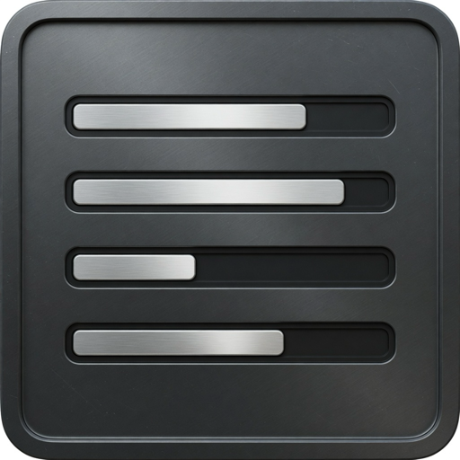
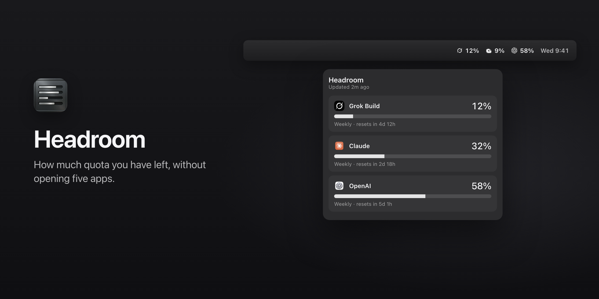
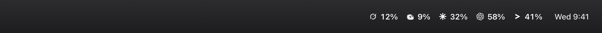
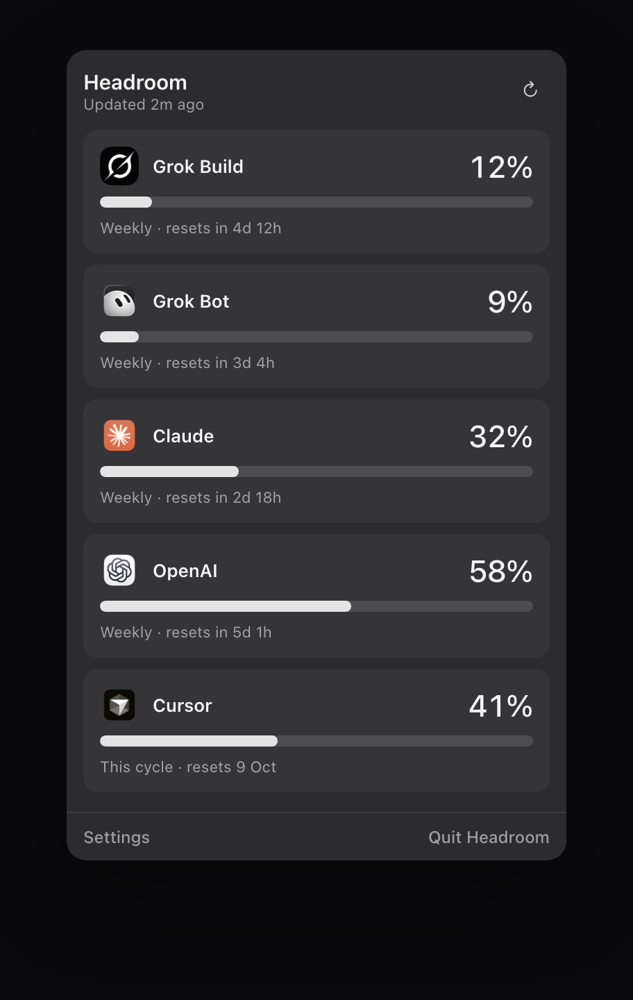

<p align="center">
  
</p>

<h1 align="center">Headroom</h1>

<p align="center">
  <strong>Subscription quota in the macOS menu bar.</strong><br>
  Grok, Claude, OpenAI, and Cursor — used percent, reset time, on this Mac only.
</p>

<p align="center">
  
  
  
  
</p>

<p align="center">
  
</p>

Headroom is a menu-bar extra. It does not live in the Dock. It reuses logins you already have. It does not ask for API keys, and it does not keep names, emails, or tokens on disk.

<p align="center">
  
</p>

## Glance first

The extra shows **used %** for every provider you turned on.

| Extra | What you see | Sign in with |
| --- | --- | --- |
| Grok Build | Weekly pool | `grok login` |
| Grok Bot | Weekly pool | Grok Bot app |
| Claude | 7-day window | `claude login` |
| OpenAI | Weekly window | `codex login` |
| Cursor | Billing cycle | Cursor app |

Click the extra for reset times, session windows, and sign-in. Claude’s 5-hour session is in the popover only. Cursor is labeled **This cycle**, never Weekly.

<p align="center">
  
</p>

## Why it exists

Each of those tools already knows how much quota you have left. None of them put it next to the clock. Headroom does, as tiny percents or iStat-style meters, then gets out of the way.

- **Local-first.** No Headroom account, no Headroom server, no telemetry.
- **Your logins.** Sessions stay in `~/.grok`, Keychain, `~/.codex`, and Cursor’s own database.
- **Independent meters.** One provider failing never blanks the others.
- **Two looks.** Percents or vertical used-bars. Refresh every 5, 10, 15, or 30 minutes. Launch at login if you want.

Numbers in the screenshots are sample data.

## Install

There is no notarized download yet. Build on the Mac that will run it:

```bash
git clone https://github.com/felipedrf74/headroom.git
cd headroom
./scripts/build.sh
open /Applications/Headroom.app
```

Xcode 27 is preferred. Command Line Tools are enough for the `swiftc` fallback.

After opening, look at the **right side of the menu bar**. Opening the app again from Finder re-shows the popover.

The build is ad-hoc signed and **not sandboxed** — it has to read CLI credential files. If macOS blocks the first launch: **System Settings → Privacy & Security → Open Anyway**.

## Sign in

1. Click Headroom in the menu bar.
2. On a provider that isn’t signed in, click **Sign In**.
3. Finish login in the browser, Terminal, or app that opens.
4. Headroom picks up the session and shows usage.

The same controls live in **Settings → Accounts**. Turning a provider off hides it from Headroom; it does not log you out of that provider.

Claude tokens expire about every eight hours. Headroom refreshes them the same way Claude Code does and writes the new tokens back to Keychain, leaving MCP secrets in that item untouched.

## Privacy

Headroom caches only percentages, reset times, and window labels in `~/Library/Application Support/Headroom/`. See [PRIVACY.md](PRIVACY.md).

## Settings

Accounts, menu-bar style (Percents or Meters), refresh interval, and launch at login. Bundle ID is `app.headroom.mac`.

## Develop

```bash
./scripts/build.sh
```

DerivedData is forced to `~/Library/Developer/Xcode/DerivedData/Headroom`. UI, tokens, and provider contracts: [`.grok/skills/headroom-macos/SKILL.md`](.grok/skills/headroom-macos/SKILL.md). How to send a change: [CONTRIBUTING.md](CONTRIBUTING.md).

## License

[MIT](LICENSE). Headroom is not affiliated with xAI, Anthropic, OpenAI, or Anysphere.
